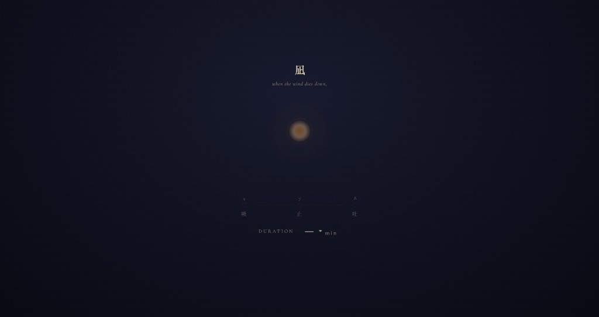

# Nagi 478

[日本語](./README.ja.md) | English

A minimal 4-7-8 breathing guide you can use right away when you want to calm your breathing.

### Quick Access
- Live URL: [https://nagi478.22311092ys.workers.dev/](https://nagi478.22311092ys.workers.dev/)

### How To Use
1. Open the [live page](https://nagi478.22311092ys.workers.dev/)  
2. Select minutes in `duration`  
3. Press `Start`  
4. Use `Pause` / `Stop` whenever needed

### Tips
- Use it in a quiet place with lower screen brightness
- Earphones make audio cues easier to hear
- Turn off notifications before starting for better focus

### Notes
- This app is not intended for medical treatment
- Stop immediately if you feel shortness of breath or dizziness

### Contact
- Bug reports / requests: [Issues](https://github.com/y177649/Nagi478/issues)
